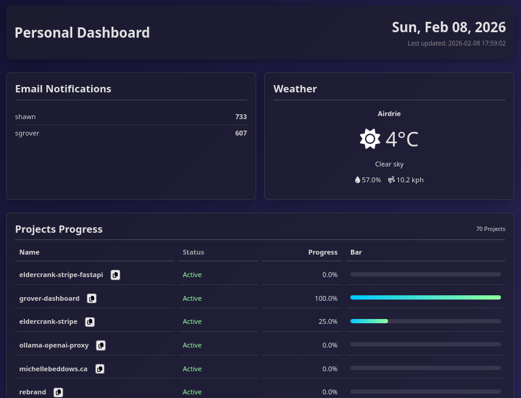

# Personal Dashboard

A Python-based personal dashboard that generates an HTML file every hour with:
- Email notifications (multiple mailboxes)
- Weather information
- Project progress tracking
- Current date and time

## Screenshot


## Features

- **Email Integration**: Shows unread email counts from multiple mailboxes
- **Weather Data**: Current weather information from OpenWeatherMap
- **Project Tracking**: Progress indicators for your projects
- **Responsive Design**: Works well on different screen sizes
- **Automated Updates**: Can be scheduled to run hourly

## Setup

1. Clone the repository
2. Install dependencies using uv:
   ```
   uv pip install -e .
   ```
3. Create a `.env` file based on `.env.example`:
   ```
   cp .env.example .env
   ```
4. Fill in your email and weather API credentials
5. Run the dashboard generator:
   ```
   python generate_dashboard.py
   ```
6. Add a cron job to periodically call this process (usually via `crontab -e`).
   ```
   # to update every 30 minutes
   */30 * * * * cd /home/USERNAME/path/grover-dashboard && ./.venv/bin/python generate_dashboard.py
   ```
## Usage

The dashboard will generate a `dashboard.html` file in the `dist` folder that you can set as your browser's new tab page.

## Background

I create "research" projects on a regular basis to learn or explore various coding concepts, or even just to see if a project might be feasible.  This adds up over time and I wanted a better way to track those random projects.  I also wanted a way to have an "at-a-glance" page to show me the status of various things I might be interested in.  To start with I'm focusing on the current weather in my area and how many unread emails I have (without having to switch to my mail client).  This project provides a tool that does all of that for me.  

Eventually I'd like to expand this to include tracking my finances, appointments, and more.

## Projects

A project is just a working directory for something.  This could be a python application, a book, a graphic or video project, or whatever else you want.

Projects are currently hard coded to look for `$HOME/Projects/customers`, and `$HOME/Projects/research`.  The sub directories of these locations are candidates to be considered a project.

### Progress

Progress is determined in one of two ways:

1. a `tests/acceptance.py` unit testing file exists in the project directory.  This unit test file indicates what tests must pass to consider the project completed.  (Only applies to Python projects with unit testing)
2. a `docs/acceptance_checklist.md` file exits.  The "checked" items are used to calculate the progress. (See [docs/acceptance_checklist.example.md](docs/acceptance_checklist.example.md))
3. If neither option is found "Unknown" is returned.  Any project marked Unknown is an indicator that project should be updated or pruned.


